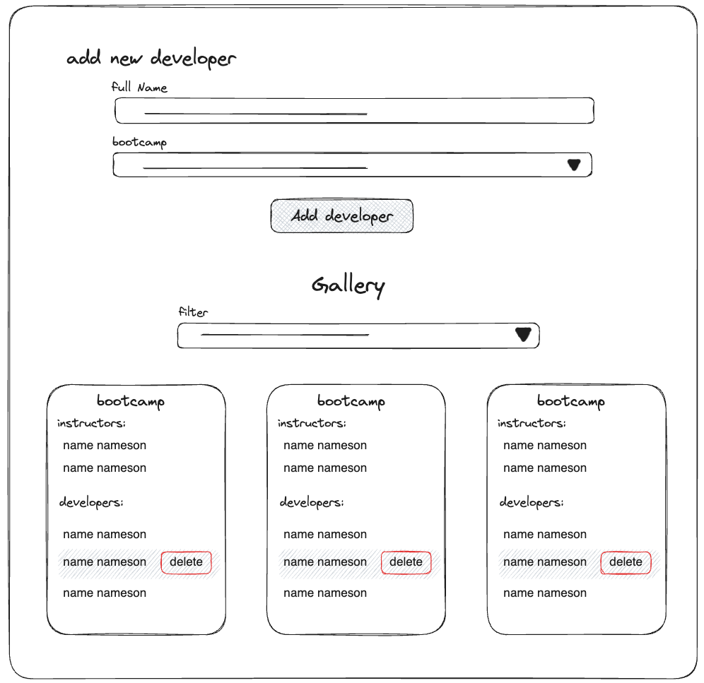
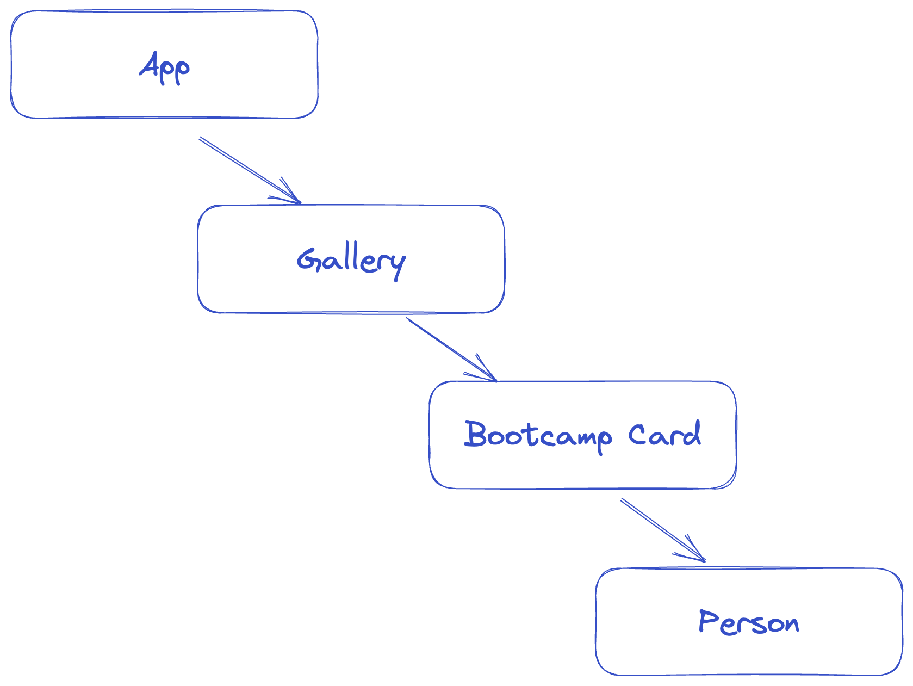

# &lt;/salt&gt;

## React - Salt Instructors & Developers

We as instructors have so much to do so we need help keeping track of all developers. Your task is to create a simple UI for us to add & remove developers in different bootcamps and to be able to filter them by bootcamp in the UI.

You will only need to work in the frontend folder. You might recognize it as template code from creating a new React TypeScript project with Vite. This is exactly what it is! You need to modify, remove and create things here to reach your goal.

We recommend that your first command is:

```shell
npm i && npm run frontend
```

The backend server for this weekend test is already available and you **don't** have to make any changes there. Your frontend should communicate with the backend server to retrieve, add and delete developers. To install and start the server you have to run the following from the project's root folder:

```shell
npm run server
```

The server runs on port `3001` and the frontend should run on port `5173`. For information about your available endpoints go to our Swagger API Specs at [http://localhost:3001/swagger](http://localhost:3001/swagger).

> Note: 
> We recommend playing around with the API through a REST API Client like [Postman](https://www.postman.com/downloads/) or [Insomnia](https://insomnia.rest/). We have added the collection `json` files for both for the server to help you out.

## Specifications

Read the UI and Technical specifications below carefully.

These specifications follow the [RFC2119](https://www.ietf.org/rfc/rfc2119.txt) standards (a good thing to read in your spare time).

### UI Specifications

#### Adding Developers

- There MUST be a form for adding a new developer.
- The form MUST contain an input field for the developer's full name.
- There MUST also be a select element in the form where the user can choose which bootcamp to add the developer to.
  - Bootcamps:
    - jsfs
    - jfs
    - dnfs
- When the user submits a new developer the developer MUST appear in the list of developers in the correct bootcamp list without a page reload.
- It MUST be easy to add, select and remove developers. For example, adding a new developer by hitting the 'Enter'-button.
- An error message MUST be displayed to the user if the user tries to add a developer with invalid input values.

#### Displaying Bootcamps

- There MUST be a gallery that displays the bootcamps.
- The bootcamps MUST be visually separated.
- Each bootcamp section MUST display the name of the bootcamp, a list of instructors, and a separate list of developers.
- There MUST be a select element that the user can use to filter which bootcamps are displayed.
- The selection list MUST have options:
  - all
  - jsfs
  - jfs
  - dnfs
- Each developer in the lists MUST be clickable and when the user clicks on the developer a delete button MUST appear. When the user clicks this button the developer MUST be deleted from the list without reloading the page.
- The instructors and developers lists SHOULD be easy to visually separate.

|  |
| :-------------------------: |
| Example of this application |

### Technical specifications

- Your application MUST be written in TypeScript.
- You MUST keep the fetched data in a state object and you SHOULD fetch the data on the initial mount.
- You MUST NOT store the data in LocalStorage.
- You MUST use only functional components.
- You MUST use at least 4 levels of components (for an example see the figure at the end).
- You MUST use `props` for passing the necessary information between components. You MAY NOT use React Router, useContext nor Redux.
- You MUST use Semantic HTML elements.
- You MUST have a clear naming strategy for your CSS and class names (for example BEM).
- You SHOULD have a mobile-first approach.
- You COULD have suitable unit tests - we will run your tests, and expect no errors. Make sure that the tests you write pass.

#### Tech specification for test correction

In order for our automated correction to run properly you will need to use the classes and ids in the list below.

##### Here is what our e2e-tests will check

| ID                 | className                              | Purpose                                                                                                                                                                       |
| ------------------ | -------------------------------------- | ----------------------------------------------------------------------------------------------------------------------------------------------------------------------------- |
| `addDeveloperForm` |                                        | Form for adding new developer                                                                                                                                                 |
|                    | `form__input-name`                     | Input field for developer name                                                                                                                                                |
|                    | `form__button-addDev`                  | Button for adding a new developer                                                                                                                                             |
|                    | `form__error-message`                  | If input values are invalid we will look for this element to exist. If you use a set timeout, make sure to display the message for a min of 1000 ms.                          |
|                    | `gallery`                              | We will look for this class to exist on the container for the bootcamp lists                                                                                                  |
|                    | `gallery__filter-select-bootcamp`      | We will filter what bootcamps are shown by selecting a bootcamp option from a dropdown with this class                                                                        |
|                    | `gallery__bootcamp-list`               | To see how many bootcamps are being rendered we will count the elements with this class when the filter selection value shows `all` the bootcamps and with just one bootcamp. |
|                    | `bootcamp-list__person--developer`     | To see if a developer has been added we will compare the number of elements with this class before and after adding.                                                          |
|                    | `bootcamp-list__person--developer`     | We will click on a developer item.                                                                                                                                            |
|                    | `bootcamp-list__person--instructor`    | We will try to click a instructor item.                                                                                                                                       |
|                    | `--selected`                           | We expect this class to be on selected developer elements                                                                                                                     |
|                    | `bootcamp-list__person__button-delete` | To delete a developer we will look for a button with class this class on a developer element that has the class `--selected`. An instructor cannot be deleted.                |

### Running e2e tests

In this repository there's a `e2e`-folder that contains e2e-test using [Cypress.IO](http://cypress.io). This should be run separately from your application (your solution).

1. Start your backend `server` and your `frontend` application and ensure that your client is running on `http://localhost:5173`
2. To install and start the e2e tests, in a separate terminal window, you have to run the following from the project's root folder:

   ```bash
   npm install && npm run test
   ```

This installs and runs the tests headlessly. You can also run `npm run cypress` to see the tests visually instead of in the console.

### Handing in the test

- Check that you have no console errors.
- Make sure it runs from a clean `npm i && npm start` in both the `server` and the `frontend` folders.
- As usual, hand in your test by committing and pushing to your personalized GitHub repository.

Make it work, and then if you have time, make it great (and if you still have time, make it pretty)!

## FAQ

Can we use Axios for fetching?

> Yes, use any library that you want.

Can we use localStorage?

> No.

Can we use SASS/SCSS for the styling?

> Yes, but you will have to add and set it up yourself.

Can we use Bootstrap or Tailwind for styling?

> Yes, but you will have to add and set it up yourself.

I'm so stuck, and I don't know how to get started!

> Take a break, you have all the information and skills you need to solve this. Go through lecture slides and previous labs.

Do I need to make it pretty? Or can I just focus on the functionality?

> For this test, our preference is going to be functionality. I.e.
>
> - All the features should be working.
> - All the technical specifications are followed properly.
> - You have put the CSS Classes and the specified IDs on the elements for the tests to pass.

|  |
| :---------------------------------------------: |
|     Illustration of 4 levels of components      |
